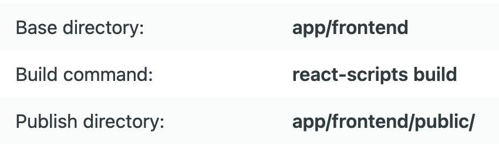

# User profile fullstack demo

## Details
Backend url: `https://user-profile-demo-backend.netlify.app`

Frontend url: `https://user-profile-demo-frontend.netlify.app/public`

## Netlify details
Be sure to add `npm run build` build command for frontend app

## References
Netlify guide 
  `https://dev.to/ebereplenty/full-stack-authentication-and-hosting-nodejs-reactjs-heroku-netlify-3fcm`
_Backend sample app_ 
  `https://github.com/EBEREGIT/auth-backend.git`

_Frontend sample project_ 
  `https://github.com/EBEREGIT/react-auth`
